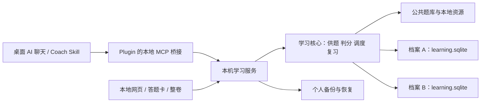

# 本地 AI 考公 Plugin 系统设计

设计日期：2026-10-02。状态：设计定稿，功能待实现与验收。

对照基线：`gongkao-practice.skill` v0.9.0（`abc13ef07340d4e8a7f988c864185132356e1c92`）与 `gongkao`（`71e9dd7e7bd2689014c7a8af18fdb62556a860c3`）。本文描述目标系统；不表示当前 v0.9 已实现本地持久化、完整安装包或可靠恢复。

## 1. 产品决策

交付一个可以导出、复制、安装的本地 Plugin 学习包。多人可以安装同一个公共包，在各自电脑上长期使用；每个人的作答、画像、错题、复习任务和学习计划保存在自己的本地档案中。

网站入口采用本地网页，AI 聊天入口采用支持本地 MCP 的桌面宿主。两个入口调用同一套学习服务，读写同一份本地记录。聊天记录可以帮助理解上下文，学习进度以本地数据库为准。

| 用户要求 | 确定方案 | 验收依据 |
| --- | --- | --- |
| 开箱即用 | 平台专用 ZIP 包带运行时、依赖、规则、基础题库和安装启动器 | 干净电脑无需 Git、npm、Python、Docker 或数据库安装 |
| 多人使用 | 每台电脑独立数据；同一系统账号可建立多个学习档案 | A、B 使用同一个包，记录互不进入对方档案 |
| 持续备考 | 每题自动提交、本地事务、断点恢复、备份与迁移 | 换聊天、重启、升级、换机后继续原进度 |
| 网站和 AI 都用 | 本地网页 + 本地 MCP，共用学习核心 | 网站作答后，AI 能读取已提交结果并安排下一步 |
| 没有部署条件 | 服务按需运行在本机，不需要云服务器、域名或公网端口 | 安装、供题、保存和恢复无需访问自建远程服务 |
| Plugin 不上架 | 本地 marketplace + 可复制的安装包 | 通过实际桌面宿主发现、启用和调用工具 |
| AI 为核心 | AI 解释、诊断、编排；学习核心执行判分、选题、复习和保存 | 训练建议有记录依据，并转为可执行的下一轮训练 |

首次支持 **Windows x64 + Codex 桌面本地宿主 + 本机浏览器**。其他系统和宿主须分别完成安装、工具与界面验收后再列入支持范围。安装学习包之前，用户仍需具备可用的 AI 宿主和模型访问权限。

本地保存不等于模型完全离线。使用云端 AI 时，工具返回的题目、必要的学习摘要和用户提问会进入模型上下文；不默认上传整库历史。没有 AI 网络连接时，本地真题练习、判分、记录、复习和已有报告仍可使用。

### 第一版范围

行测 / 职测 / 公基选择题，包括基础训练、章节练习、3 题快刷、20 题套题、可用的真题整卷、错题复习和阶段报告。单选、判断、多选分别按规则判分，未支持的题型必须明确不可用。

申论与面试后续扩展，届时单独设计评分与反馈标准。第一版不把行测正确率解释为整个公考准备度，也不计算“上岸概率”。产品以可观察的能力提升为目标。

## 2. 长期学习体验

### 首次使用

1. 接收学习包，运行安装器，将 Plugin 加入本地 marketplace，再在宿主中启用。
2. 说“初始化我的考公系统”，建立本地学习档案，填写考试方向、地区与目标日期；不知道目标日期可以跳过。
3. 系统展示题库实际覆盖范围；先进行可跳过的小批诊断，再生成初始路线。
4. 说“开始练习”，默认从 3 题小批次开始，无需反复填写题量、难度和时长。

### 日常使用

- “继续上次”：读取未完成训练，恢复当前题、已有草稿和有效计时。
- “开始练习”：优先续接未完成训练，再处理到期复习；随后补诊断样本或当前路线弱项。
- “只练资料分析”：按明确目标供题；库存不足时展示缺口，由用户选择扩大范围或换训练方式。
- “做一套真题”：仅展示经总题数、题号、题型与资源可用性校验的试卷。
- “我今天只有 10 分钟”：记录整轮预算，仍以最多 3 题的批次执行，批后重新调度。
- “我最近练得怎么样”：返回最近 7 天、30 天和全程的真实统计，并说明样本不足之处。

普通训练提交后立即保存并给出反馈；用户随时暂停。严格限时模拟采用整卷提交，考试中不展示答案或解析。暂停、恢复和完成的动作本身不再次增加作答次数。

### 一个持续训练闭环

`诊断 → 学方法 → 分层练习 → 错因确认 → 间隔复习 → 新题迁移 → 限时测评 → 调整路线`

AI 每次给出“今天为什么练这个”的简短依据，随后直接启动训练。答案确定的题由程序判分；AI 负责解释方法和分析思路。只有选项、没有用户思路时，错因标为待确认或低置信度，不能把猜测写成事实。

## 3. 架构与两个仓库的分工



| 组成 | 所在位置与职责 | 复用方式 |
| --- | --- | --- |
| Coach / Onboarding Skill | `gongkao-practice.skill`，解释训练规则、调用工具、组织教学 | 延续现有两份 Skill，随包携带全部引用规则 |
| 学习核心 | 同仓库 `plugin-ui/lib/`，只保留一套判分、调度、路线和复习规则 | 复用并修正 v0.9 的纯函数；引入 SQLite 存储适配层 |
| MCP 桥接与本机服务 | 同仓库 `plugin-ui/` | 将现有 HTTP MCP 拆成可复用的工具注册与本地入口，桥接采用 stdio |
| 本地网页与答题组件 | 同仓库 `plugin-ui/public/` 或其构建产物 | 快刷复用 widget；整卷交互按依赖边界复用 gongkao 的答题流程 |
| 公共题库 | gongkao 的题库快照，经构建期导入与校验 | 固定源 commit、题库版本和资源哈希，导入流程在开发端执行 |
| 整卷与基础训练规则 | gongkao 已有服务和纯规则 | 复用训练目的、15 题基础轮次、服务端事务与提交约束 |
| 导出与安装 | skill 仓库的构建脚本、平台安装器 | 合并现有 `plugins/`、`plugin-package/` 与 `local-test/` 的重复配置 |

`gongkao-practice.skill` 是本地产品的代码与发布主仓库。`gongkao` 提供可追溯的题库与训练流程资产，不成为学习者必须部署的在线后端。无需给每位学习者安装 MariaDB、Redis、Qdrant 或完整后台管理站。

复用界面时先检查依赖与许可证，抽取真正需要的组件和纯规则；判分、错题与统计统一调用本地学习核心。未来 gongkao 网站若接入同一核心，也通过存储适配器与协议接入，不复制另一套学习状态算法。

## 4. 多人隔离与档案绑定

### 三种场景

| 场景 | 数据归属 | 使用方式 |
| --- | --- | --- |
| 多个人各用自己的电脑 | 各自系统用户目录中的独立数据 | 默认支持，无需服务器注册或账号体系 |
| 同一电脑、不同系统账号 | 按系统账号分开数据目录与文件权限 | 推荐用于有隐私隔离要求的共用电脑 |
| 同一系统账号、多个学习者 | 每人一个 `learner_id` 和独立 SQLite 文件 | 首次绑定选择档案，后续连接固定归属 |

同一系统账号下的档案隔离用于避免误写，不承诺阻止该系统账号持有人直接读取别人的本地文件。需要访问权限隔离时使用独立系统账号。

一个学习者可以有多个备考目标 `goal_id`。考试目标分别维护画像、路线与复习任务；跨目标复用已有记录须明确发起，不自动混入。不同聊天或 Project 可绑定同一个目标，实现共同进度；Project 不再是数据隔离的唯一依据。

### 绑定规则

1. 本机服务生成 `learner_id`、`goal_id` 与不透明的 `binding_id`；由本地档案选择界面确认绑定。
2. 每个网页客户端和 MCP 调用上下文持有自己的绑定。宿主提供稳定上下文标识时保存映射；未提供时明确选择档案并持有绑定，不猜测聊天身份。
3. 所有个人读取和写入都通过绑定定位档案。公共题库状态查询可以不需要绑定。
4. 服务端创建 session 时固定 `learner_id`、`goal_id`、绑定与规则版本。切换当前默认档案只影响新连接，已有 session 不改归属。
5. 每次作答、恢复、注释和报告调用校验绑定与 session / attempt 的归属，不能凭任意 `project_state_id` 改写归属。
6. 禁止让模型传入数据库路径。学习服务只打开预先登记、位于个人数据根目录下的档案。

两份安装包的随机身份独立生成。创建者导出包时不能携带现有 `learner_id`、绑定、设备凭据、个人数据库或模型密钥。

## 5. 存储布局与寿命

Windows 默认个人数据根目录为 `%LOCALAPPDATA%\GongkaoCoach\data`，与代码安装源和宿主 Plugin 缓存分开。不把工作区、当前目录或 `${PLUGIN_ROOT}` 当作个人数据目录。

```text
GongkaoCoach/
  packages/                          # 版本化的公共安装源
  data/
    registry.sqlite                  # 档案、目标、绑定登记
    profiles/<learner_id>/
      learning.sqlite                # 个人学习记录
      attachments/                   # 个人笔记及自导入资源
      backups/                       # 本地自动快照
    runtime/                         # 进程发现信息与本机连接凭据
    banks/<bank_version>/            # 已校验公共题库缓存
```

公共包内含离线基础题库；安装后可复制到共享的版本化题库缓存。旧训练引用的题库版本在仍被 session 使用时保留。个人数据默认不落在 OneDrive 等同步目录中；需要迁移时走一致性备份，避免直接同步活跃 SQLite 文件。

登记库只负责档案定位和绑定映射。考试目标的具体设置、学习 revision 与全部可变学习数据都属于对应个人数据库；一次作答的事务不跨两个数据库更新学习统计。

### 逻辑数据表

| 数据 | 关键字段和用途 |
| --- | --- |
| `learners` / `goals` / `bindings` | 身份、考试目标、客户端绑定和状态版本 |
| `questions` / `question_versions` | 稳定题号、内容版本、题型、来源、答案与资源引用，属于公共题库 |
| `papers` / `paper_questions` | 原卷总数与有序成员关系；同题可属于多卷 |
| `sessions` / `session_items` / `question_snapshots` | 模式、训练目的、状态、题序、冻结内容、资源引用、期限、草稿与计时段 |
| `attempts` | 一次正式作答的答案、服务端判分、耗时、提交时刻和题目版本 |
| `attempt_annotations` | 用户思路、错因及修订来源，不覆盖原作答事实 |
| `review_tasks` / `review_task_attempts` | 考点、锚题、复习阶段、到期时间与关联作答 |
| `ability_stats` / `route_progress` | 可从作答重算的画像和路线进度，保存规则版本 |
| `idempotency_records` / `events` | 请求去重、关联实体和必要事件；不存无限量点击日志 |
| `coach_notes` / `reports` | 教学建议与阶段快照，注明样本范围和证据 |
| `schema_migrations` | 个人数据库 schema 与迁移历史 |

个人 `attempts` 按考试目标分区查询，不截断为“仅保留最近 300 条”。最近 30 条等窗口只用于画像计算；完整历史保留，用于重算、趋势与审计。

题目在 session 创建时固定内容版本和判分规则，保存必要的个人历史快照，不受后续题库覆盖影响。已有 attempts 或未完成 session 依赖的资源不得随题库清理删除。用户自导入题放在个人题库区，不回写公共包。更正答案保留原评分，并以显式的重评分事件生成修订结果。

## 6. 本地服务与双入口

### 启动方式

导出包自带锁定的 Node 24 运行时、SQLite 能力、MCP 依赖与网页构建产物。学习者不在本机执行依赖安装。构建产物必须逐平台验证，不能复制带原机器绝对路径的依赖目录充当发布包。

Plugin 的 stdio 入口和“打开学习网页”启动器都先查找当前系统用户的学习服务。已有兼容服务则连接；没有则在后台启动。服务只监听 `127.0.0.1`，由系统分配可用端口，不把固定 8787 端口作为运行前提。

每个系统用户一个服务负责数据库写入。使用进程锁、健康检查和随机实例标识防止并发启动；发现文件中的 PID 与端口须通过握手验证，不能仅凭 PID 相同认定服务可用。协议不兼容时说明需要重启客户端，不同时启动两个版本来争夺个人数据库。

stdio stdout 仅输出 MCP 协议，诊断写 stderr。退出聊天不删除数据；网页仍在使用时服务继续运行。服务停止或电脑重启后，下次启动从数据库恢复。

### 网页访问

本地网页提供今日推荐、继续训练、章节目录、整卷目录、错题复习、学习报告和档案 / 备份管理。浏览器只缓存草稿与显示状态，正式记录进入本地数据库。

网页会话与 MCP 桥接使用本机随机凭据。打开网页时交换一次性启动票据，随后用本机会话；长期凭据不写入 URL、日志或公共包。写接口校验来源与绑定，拒绝外部网站直接调用本地写接口。资源访问只按登记的资源 ID 读取。

第一版网站用于完整答题与查看记录；需要 AI 解释时，通过桌面聊天读取同一 session 的上下文。网页内独立 AI 聊天作为后续适配，可由用户选择模型连接并将密钥保存在个人系统凭据存储中；不把“本地网页答题可用”描述成“脱离宿主即可使用所有 AI 能力”。

### 宿主兼容

本地 MCP 和 Plugin 在目标桌面宿主验收。MCP Apps 答题卡可用时提供聊天内界面；不可用时返回同一 session 的本地网页入口，并保留文字作答协议。网页入口仍是正式入口，不另建学习记录。

OpenAI 官方文档支持通过本地 marketplace 分发 Plugin，并使用 `skills/`、`mcp.json` 等组件；本地 Codex 宿主支持 stdio MCP。安装缓存由宿主管理，因此个人数据必须独立保存。具体宿主界面能力仍须真实验证。[Plugin 包与本地分发](https://developers.openai.com/plugins/build/plugins)、[本地 MCP 配置](https://learn.chatgpt.com/docs/extend/mcp?surface=cli)。

## 7. 自动保存、恢复与并发一致性

### 状态机

普通训练：`CREATED → ACTIVE ↔ PAUSED → COMPLETED`，可明确终止为 `ABANDONED`。严格模拟：`CREATED → ACTIVE → SUBMITTED / EXPIRED`。严格模式无暂停控制，关机期间考试期限继续流逝。

普通题每次提交正式答案时执行一个事务：

1. 校验绑定、session 状态、题位、版本与请求去重键。
2. 按冻结的标准答案和题型判分，生成正式 `attempt_id`。
3. 写入 attempt，更新当前题位、画像、错题、复习任务和符合条件的路线进度。
4. 保存关联事件与新 revision，提交事务。
5. 提交成功后才向界面或模型返回“已保存”与结果。

不会要求模型在题后把整份 state 复制回聊天，也不会靠 session summary 累加正式作答。AI 诊断失败只影响诊断，不回滚已经保存的答案。

### 去重和冲突

- 同一个 session 题位只有一次正式作答，数据库约束为 `(session_id, session_item_id)` 唯一；同题在新的复习 session 可产生新的 attempt。
- 每个写请求携带 `idempotency_key`。同键同内容的重试返回原结果；同键不同内容返回冲突。重复请求不会再次更新画像或复习阶段。
- session 有 revision。对同一题位的冲突修改返回当前正式结果，不能用旧聊天 state 覆盖新记录。
- 同一档案的不同 session 可以训练；不同档案并行运行。所有写入经过单一本机服务，SQLite 事务与锁超时保证完整提交。
- 暂停、恢复、完成和报告是独立动作，不重复提交已保存 attempts。

### 草稿和恢复

选择、跳题、笔记和计时段保存到 session 草稿；普通训练点击正式提交前不计入正确率。必要时以短防抖写入本机，浏览器 IndexedDB 保存待送草稿并注明尚未同步。

恢复返回确切的 session 状态、当前题位、已提交结果、未提交草稿、有效计时、题库 / 规则版本与到期状态。暂停的未提交题不判错；原 `session_id` 的重启调用不能悄悄覆盖旧会话。

严格模拟的草稿只保存答案，不提前判分；最终提交一次性提交所有正式 attempts 与统计。到期由保存的绝对截止时间判定，重新启动不能延长考试。灵活限时记录暂停段并扣除暂停耗时。

## 8. AI 教练、路线与复习规则

### 职责边界

| AI 负责 | 学习核心负责 |
| --- | --- |
| 理解目标、解释推荐依据、讲解方法 | 读取目标与记录、选择有效题目、执行确定规则 |
| 分析用户提供的思路，提出错因候选 | 保存确认状态、版本和来源，不把猜测当判分事实 |
| 提出路线调整与训练策略 | 验证修改、保存进度、生成下一轮可执行计划 |
| 根据错误生成同考点变式 | 校验题型、选项、唯一答案与来源标记后才能供题 |
| 解释周报和行动建议 | 计算真实统计、样本数、有效用时与趋势 |

变式题标为 AI 生成，保留生成和校验记录；不作为真题基准测评来源。政治、常识中具有时效性的内容带知识截止与来源；无法核实的内容不能生成确定答案的基准题。

### 路线推进

区分 `source_mode`（章节 / 套题 / 试卷等题源方式）和 `purpose`（诊断 / 基础过关 / 巩固 / 复习 / 测评）。只有符合路线条件的已提交训练才推进路线。

沿用 gongkao 基础训练规则：一个叶子考点一轮 **15 题，答对至少 9 题过关**。3 题碎片批次可以累计组成同一 15 题轮次；普通 10 题章节练习和 20 题混合套题不自动标记基础过关。库存不足 15 道可用题时显示缺口，不以重复题或生成题虚补过关数量。

首次诊断覆盖目标考试可用模块，样本不足时标记“待诊断”；不从资料分析几道题推导其他模块掌握度。后续结合新题正确率、有效耗时、错误分布和复测结果调整路线。模块权重与目标时间来自有版本的考试配置，缺失时显示未知，不随意制造官方标准。

### 复习规则

- 复习任务用 `review_task_id` 与稳定考点 ID 关联，保留锚题和错误原因。
- 原题或同考点新题只有显式附属于该复习任务，才更新任务阶段；任意同 subtype 题不自动消除错题。
- 默认间隔 1、3、7、14、30 天，按档案时区计算，策略有版本。
- 复习答错回到短间隔；正确且速度达标推进阶段。没有速度基准时按正确率规则推进，并标记速度尚未校准。
- 每次推进以唯一 attempt 关联，只能消费一次。暂停或重复摘要不推进任务。
- 新题迁移结果与原题重做结果分别呈现，避免记住答案造成掌握度虚高。

### 每周反馈

报告同时提供正确率、每题耗时、样本量、模块覆盖、到期复习完成情况、新题迁移正确率与完整模拟卷的时间分配。与个人基线比较时说明题源、难度、模式和样本差异。建议最多给出几个明确动作，并能一键转为训练。

## 9. 工具与协议设计

以下均为目标协议。现有名称尽量保留；个人状态的读取与写入迁移到绑定和存储层，调用者不再直接提交整份可覆盖的 state。

| 工具 / 类别 | 目标行为 |
| --- | --- |
| 新增 `get_learning_context` | 根据绑定读取目标、路线、复习、未完成训练和精简统计 |
| `initialize_project_learning_state` | 兼容初始化入口，实际创建本地档案 / 目标并返回绑定；已有档案不能被重复初始化清空 |
| `get_question_bank_status` | 返回题库版本、模块库存、完整可用试卷、缺失资源与题型限制 |
| `configure_project_study_route` | 验证绑定与 revision，事务保存路线和偏好，返回持久化后的结果 |
| `plan_training_session` | 从数据库读取最新状态，返回可执行训练目的、理由、预算和当前批次请求 |
| `start_quiz_from_bank` / `start_paper_from_bank` | 按已验证库存创建持久 session，固定题序与版本 |
| `start_quiz_session` | 自导入 / AI 题的校验入口，保存来源与版本；不把任意输入答案当成可信真题 |
| `submit_quiz_answer` | 普通题判分并自动保存，返回 attempt、保存状态与 revision |
| `set_quiz_error_code` | 对已有 attempt 添加或修订错因，不重新累计作答 |
| `next_quiz_question` / `pause_quiz_session` | 验证状态与归属，保存当前位置 / 暂停段 |
| 新增 `resume_quiz_session` | 从数据库恢复原 session；不能通过重新 start 覆盖旧状态 |
| 新增 `submit_paper_session` | 严格模拟整卷事务提交，重复提交返回原结果 |
| 新增 `get_progress_report` | 从正式作答计算阶段报告，供网页与 AI 共同读取 |
| 新增 `open_learning_ui` | 生成绑定本地 session / 目标的网页入口，不暴露长期凭据 |
| `apply_project_learning_events` | 过渡兼容；只接收可校验、可去重的遗留事件，不允许模型覆盖画像或宣称判分事实 |

个人档案创建、绑定选择、备份恢复和档案删除由本地管理界面提供，避免大量低频管理工具占用 AI 上下文。

统一返回协议包含：`api_version`、`binding_id`、`goal_id`、相关 `session_id` / `attempt_id`、`revision`、`save_status` 和必要摘要。错误使用 `BINDING_REQUIRED`、`OWNER_MISMATCH`、`REVISION_CONFLICT`、`BANK_INSUFFICIENT`、`RESOURCE_MISSING`、`SESSION_EXPIRED` 等稳定代码，给出可以执行的恢复动作。

## 10. 题库质量与整卷完整性

题库构建必须把唯一题目与试卷成员关系分开。题目去重不能丢弃其他试卷中的题序与成员关系；来源 ID、内容版本与跨源映射保留。

完整可用试卷必须同时满足：

1. 题目成员数等于源卷 `expected_total`。
2. 题号覆盖预期范围，无重复、无缺号。
3. 每个题位都有可解答题干、有效选项、合法答案与受支持题型。
4. 图片、表格、材料和选项资源可在离线包中正确呈现。
5. 题源、年份、地区与总数信息可追溯。

图片与表格使用结构化内容和本地资源引用。导入不能仅剥离 HTML 后把空选项或缺图题标为可交互。缺资源题进入隔离清单；它所在的试卷不能标为完整可用。

显式模块 / 考点筛选拒绝空标签，采用正式考点 ID 和明确别名表。专项不足时返回实际库存与缺口，不静默用其他模块补齐。没有完整可用试卷时，网页与 AI 计划都不推荐可启动的整卷。

发行清单记录源仓库 commit、题库 schema、版本、唯一题数、出现次数、可用题数、完整卷数量、资源校验结果与已知缺口。保留软件许可证及题源说明；是否可随包分发按实际资源来源确认，不因软件许可证而推定所有题源都可任意再分发。

## 11. 导出、安装、升级与备份

### 公共安装包

```text
gongkao-coach-<version>-windows-x64.zip
  install.cmd / install.ps1          # 校验、拷贝、注册与诊断
  open-learning.cmd                  # 按需启动并打开本地网页
  uninstall.ps1                     # 默认仅移除代码与注册
  .agents/plugins/marketplace.json
  plugins/gongkao-coach/
    plugin.json / mcp.json
    skills/ / references/ / assets/
    runtime/                         # 锁定的运行时和依赖
    server/ / web/ / bank/
  release-manifest.json              # 版本、源 commit、哈希与兼容范围
  README-安装.txt / LICENSES/ / source/
```

维持 Plugin 身份 `gongkao-coach`，不随每次升级创建新插件。MCP 配置指向包内实际构建入口，运行时按 Plugin 根目录或安装时解析的路径启动；中文和空格路径、缓存复制后的路径均须实测。

安装器只改自己的注册项，保留其他 Plugin 和 MCP 配置。JSON 写出为 UTF-8 无 BOM，至少验证 Windows PowerShell 5.1。遵循宿主支持的本地安装 / 重载流程，不直接修改宿主缓存，也不擅自关闭宿主或替用户改信任策略。

导出时按公共文件白名单组装，校验所有 Skill 相对引用与资源存在。禁止打包 `data/`、`.env`、个人报告、聊天、API key、调试日志、机器连接凭据和备份。压缩包必须在另一个空白系统用户目录验收，不能只在开发机源码环境验证。

### 升级与重装

1. 校验新包、兼容范围与磁盘空间，将新公共版本写入新目录。
2. 暂停新写请求并通过 SQLite 备份能力创建一致性快照。
3. 事务应用 schema 迁移，检查记录数与引用完整性。
4. 验证服务启动和恢复，再切换公共安装源，按宿主流程重载。
5. 失败时恢复旧代码与迁移前数据库；不可用旧代码打开更高且不兼容的 schema。

重复安装不能覆盖个人数据。卸载默认保留个人档案，清除个人数据必须通过明确的单独操作。Plugin 禁用、宿主重装或缓存清理也不删除档案。

### 个人备份

公共安装包与个人备份分别导出。备份包含个人 SQLite 一致性快照、自导入资源、schema、题库引用版本与校验值；不包含本机连接凭据或模型密钥。第一版同时嵌入历史作答与未完成训练所依赖的题目内容快照和必要资源，不能只保存题号、要求换机后碰巧找到同版题库。

按学习日创建自动本地快照，迁移前强制快照。建议保留最近 7 个学习日和最近 4 个周快照；用户可单独手动导出到其他磁盘。自动快照用于误操作恢复，同盘快照不能应对整盘故障。

换机时安装相同或兼容版本的公共包，再导入个人备份并重新绑定。第一版恢复默认创建新档案或整体替换指定档案，不提供未经验证的两份数据库自动合并。旧档案覆盖前先创建可恢复快照。

### v0.9 旧状态迁移

提供用户显式发起的 JSON 导入：校验 `project_state_id`、schema、题目映射与事件归属，再写入选定本地目标。旧摘要与窗口统计保存为带来源的历史快照；缺少稳定 attempt ID 的累计数不冒充可逐题验证历史，也不能重放成新作答。

根 Skill、两份打包 Skill、`PROJECT_INSTRUCTIONS.md`、Project 状态契约、调度协议和 UI 文档在实现阶段统一更新。旧 Project 范围模型作为兼容说明保留，不继续要求用户依靠聊天保存正式进度。

## 12. 实施顺序

| 阶段 | 核心工作 | 阶段出口 |
| --- | --- | --- |
| A：持续学习基础 | SQLite、档案绑定、事务提交、去重、持久 session、恢复工具 | 两个档案并行训练，重启后各自恢复，重复提交不多计 |
| B：可分发双入口 | stdio 桥接、后台本机服务、本地网页、公共包构建、安装 / 升级 / 备份 | 干净 Windows 环境安装，网站与 AI 读取相同已保存进度 |
| C：可靠训练闭环 | 修正题库导入与跨卷关系、资源质量、基础过关、考点复习、路线推进和报告 | 能完成诊断到复测闭环，完整卷和推荐库存一致 |
| D：实际宿主验收 | 安装发现、工具调用、界面或网页 fallback、断网、崩溃、升级、换机恢复 | 全部发布必过项满足后，标记可供多人长期使用 |

先完成一个垂直闭环：`安装 → 创建档案 → 做 3 题 → 自动保存 → 退出 → 新聊天续接 → 网页查看 → 升级后仍可继续`。再扩展整卷和更多教学方式。

0.9 的首要改造点是保存责任、安装运行时、恢复协议与数据质量。阶段版本可以内部试验，但未过以下发布标准之前不描述为开箱即用的长期备考产品。

## 13. 发布必过验收

| ID | 场景 | 必须达到的结果 |
| --- | --- | --- |
| I01 | 干净 Windows x64、中文 / 空格目录、PowerShell 5.1 | 安装成功，Plugin 可发现，工具可启动，无 BOM 与路径故障 |
| I02 | 导出者已经学习过，再导出公共包供另一人安装 | 接收者无导出者身份、历史、绑定、凭据或密钥 |
| U01 | A、B 在两台电脑安装同包并各做 3 题 | 各自只有自己的 3 条正式 attempts 与画像 |
| U02 | 同一系统用户建立 A、B 档案，两个聊天 / 网页同时练习 | session 固定归属，切默认档案不改变已有训练归属 |
| U03 | 跨档案 session_id / attempt_id、伪造内层归属 | 调用被拒绝，对两份数据均无修改 |
| P01 | 第 2 题正式提交后，关闭服务与宿主，再重启 | 前 2 题已保存，恢复第 3 题及草稿，不重新初始化 |
| P02 | 提交成功但客户端未收到响应，重试同请求 | 返回同一个 attempt_id，统计和复习只更新一次 |
| P03 | 暂停后恢复再完成，重复提交总结 | 每题只累计一次，未提交题不误判错 |
| P04 | 两个客户端同时对同一题位提交不同答案 | 一个正式结果，另一个明确冲突，无双重计数 |
| P05 | 写事务中断电 / 强制终止 | 事务整体提交或整体未提交，画像与作答没有半更新 |
| E01 | 网页答题，然后新聊天读取 / 恢复该 session | 对错、题序、错因、路线与数据库一致 |
| E02 | 聊天答题后网页打开同一训练 | 显示同一正式结果，旧页面不能覆盖新结果 |
| E03 | 宿主不支持内嵌界面 | 同 session 本地网页可完整练习和保存 |
| R01 | 原题错误后，用关联同考点新题复习 | 对应 task 推进一次；未关联的新题不误清任务 |
| R02 | 模拟时钟推进 1 / 3 / 7 / 14 / 30 天，含失败重学 | 到期计算、阶段和重试一致，不需真实等待数月 |
| L01 | 15 题基础轮次分 5 个小批次完成，答对 9 题 | 只过关一次；普通章节训练不改变过关状态 |
| L02 | 某考点仅有 14 道可用题，或诊断样本不足 | 明确库存 / 样本不足，不伪造过关或全模块画像 |
| B01 | 真实题库含 index 数组、图片、表格、空选项、多选 | 构建能处理索引；资源保留；异常题隔离，库存可追溯 |
| B02 | 跨卷重复题，缺号、重复号、总数不符或缺资源卷 | 保留全部成员关系；不完整卷不能启动完整模拟 |
| B03 | 专项库存不足、标签为空、没有完整卷 | 不静默跨模块补题，不推荐实际不可启动的模式 |
| T01 | 严格模拟中关闭服务，超过期限后恢复 | 不延长期限、不提前泄露答案、最终评分只提交一次 |
| M01 | 升级、重复安装、禁用、缓存清理、重装 | 已提交历史、错题、路线和未完成训练保留 |
| M02 | 迁移失败、导入损坏备份、旧代码遇到新 schema | 明确失败并保留可恢复原数据，无静默清空 |
| M03 | 换机导入个人备份 | 历史与进度一致；生成新本机凭据，重新绑定 |
| S01 | 50,000 条正式 attempts 的单档案与多个档案 | 所有历史保留；本机典型读写 p95 目标不超过 1 秒，记录测试机器与库规模 |
| O01 | AI 断网、题库服务重启、模型解释失败 | 既有真题供题 / 判分 / 保存可继续，已保存结果不丢失 |
| A01 | 错因不确定、缺速度基准、报告样本不足 | 显示未知 / 待确认与样本范围，不编造准确诊断或提分效果 |

验收须保存目标宿主版本、系统、包哈希、题库版本、复现步骤与结果。纯函数测试通过、CLI 能发现插件、MCP resource 能返回，分别只能证明对应层，不代替实际宿主的安装、跨聊天续接与多人长期保存验收。

## 14. 关键决策记录

- **本地优先**：满足无部署条件和每个人本地保存；共享的是程序和题库，个人记录各自管理。
- **SQLite 为正式记录来源**：跨聊天、跨入口和长期恢复由确定的存储负责，不依赖对话记忆。
- **每个学习者独立数据库**：便于隔离、备份、换机与排查；身份绑定仍由服务校验。
- **一个本机服务，多客户端**：统一写入和规则，防止网页、MCP 各自更新出两套进度。
- **公共包与个人备份分开**：导出给别人时安全复用公共能力，升级安装与个人数据寿命解耦。
- **AI 教学 + 确定规则执行**：建议可以个性化，评分、统计、状态迁移和保存必须可核验。
- **保留 v0.9 与 gongkao 已有资产**：围绕持久化和本地交付改造，不另起无关联产品或重复整套在线后端。
