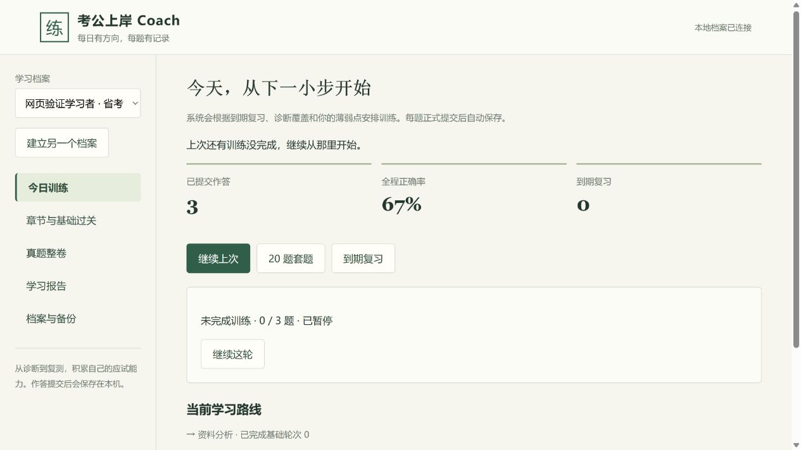

# 本地 AI 考公 Plugin 1.0.0 实现与验证

验证日期：2026-10-03（Asia/Shanghai）。交付状态：**Windows x64 本地试用包，工程验证通过**。

已实现多人分别安装、个人本地持久保存、网页与桌面 AI 共用进度的训练闭环。工程验证覆盖运行时、真实公共 ZIP、原生 Codex 安装命令和网页操作；尚未完成真实桌面新聊天的模型教学验收、两台物理电脑验收和多周学习试用，因此不将设计文档的 27 项发布标准全部标为通过。

## 交付物与环境

| 项目 | 实际值 |
| --- | --- |
| 最终安装包 | `dist/gongkao-coach-1.0.0-windows-x64-20261002-175453.zip` |
| ZIP 大小 | 约 96 MiB |
| ZIP SHA-256 | `7866bbf6a9714326f32bb4fdc20a156ed94f82ee47a1f4fb07a32bb3823e99ef` |
| 系统 | Windows 11 家庭版中文版，64 位，10.0.26200 |
| CPU | AMD Ryzen 5 7500F 6-Core Processor |
| 安装脚本测试 | Windows PowerShell 5.1；中文与空格路径 |
| 包内运行时 | Node 24.19.0；依赖与 package-lock 逐包匹配 |
| Codex 原生命令 | codex-cli 0.159.2；隔离配置目录 |
| 学习存储 | SQLite，schema 1，WAL，事务提交，synchronous=FULL |
| 源码基础 | Skill 0.9 / `abc13ef07340d4e8a7f988c864185132356e1c92` |
| gongkao 题库快照 | `71e9dd7e7bd2689014c7a8af18fdb62556a860c3` |
| 题库版本 | `saduck-71e9dd7-local-v1` |

包内 release-manifest.json 记录 7,988 个公共文件的校验值、版本和题库库存；ZIP 外另有同名 .sha256。包只组装公共源码、依赖、运行时、教学参考和题库，不从个人数据目录复制文件。完整安装包存于本地 dist，不上传为公开 Release。

## 使用和多人持续学习

1. 完整解压 ZIP，双击 install.cmd。安装器复制到个人本地应用目录，并在已安装 Codex 时通过其原生命令注册本地 Plugin。
2. 在网页创建自己的档案。以后通过桌面 Gongkao Coach 启动器打开，点击“继续上次”。
3. 在 Codex 新聊天启用插件，从网页“档案与备份”复制 AI 聊天入口并粘贴，再说“开始练习”或“继续上次”。
4. 给其他人发送同一个公共 ZIP。每个人安装后建立自己的档案；各自的默认数据目录为 `%LOCALAPPDATA%/GongkaoCoach/data`。
5. 升级前自动准备个人备份，重复安装不覆盖档案。换机单独导出 .gkbackup 并导入为新档案；卸载默认保留个人记录。

同一个操作系统账户可建立多个逻辑隔离的学习档案。需要相互保密时使用不同操作系统账户。程序不依靠聊天记忆识别使用者，网页与聊天必须明确绑定到同一个档案和考试目标。

AI 教学使用 Codex Desktop 的模型、账户与网络；网页提供本地答题、复盘、报告和备份。没有云服务器也可运行。本版没有独立网页 AI API 聊天、离线大模型、可靠申论自动评分、后台主动督促或自动跨机器同步。

## 已完成验证

### 运行时和题库

- **51 项 Node 测试通过**，最终运行约 4.42 秒，0 失败。包含实际子进程强制终止 SQLite 写事务、磁盘错误注入、真实 stdio MCP 双客户端、并发作答冲突和跨档案归属拒绝。
- **4 项 Python 导入测试通过**：源卷声明题数、HTML 图片和表格、同 ID 内容冲突、真实快照结构与多选处理。
- **23 个 JavaScript 文件语法检查通过**；便携 manifest、MCP 配置、Skill 相对引用和两份 Skill 同步检查通过。
- 根 Skill、gongkao-coach 和 gongkao-onboarding 通过 skill-creator quick_validate。验证用 PyYAML 仅安装在忽略的本地验证目录，用户包不需要 Python。
- 基础过关用 15 道同考点题分 5 批完成，9 题正确，只推进一次；14 题、混合考点、模块级标签和不匹配的模块均被拒绝。普通章节不会冒充基础过关。
- 模拟时钟覆盖 1/3/7/14/30 天复习，关联兄弟题推进任务，失败复习回退。AI 建议不计入正式错因，用户确认后计入，后续作答保留该确认。
- 严格模拟在服务关闭后仍保留原截止时间，超过期限按原草稿和空题最终判分；重复整卷提交不增加作答。

50,000 条结构化测试作答全部保留。最终 5 次学习报告读取分别为 166、163、145、155、160 毫秒，均低于 1 秒。这是当前机器上单档案测试数据的读取结果，未完成多大档案混合读写的 p95 性能验收。

### 最终 ZIP 集成检查

最终 ZIP 的 **11 项检查全部通过**，原始结果见 [local-package-verification.json](local-package-verification.json)。测试脚本真实解压 ZIP，使用包内 Node 和锁定依赖，并通过官方 CODEX_HOME 覆盖将原生安装限定在隔离的子进程配置中。

1. Windows PowerShell 5.1 从中文 / 空格路径安装。
2. 无全局 Node/npm 时，包内运行时启动全部 18 个 stdio 工具。
3. 同一公共包在两份独立数据目录运行，学习者记录独立。
4. 强制终止服务后恢复前两次正式作答和第三题草稿。
5. MCP 保存的作答立即出现在同一个本机网页 API 的报告中。
6. 新建 MCP 客户端连接后，明确绑定旧档案并继续读取旧历史。
7. 个人备份在另一个数据目录恢复为新档案，不覆盖另一位学习者。
8. 同版本重复安装准备备份，已有 MCP 客户端重连并读取原历史。
9. 包内真实试卷超过固定期限后最终判分，重复提交不多计。
10. 原生 Codex 命令注册、安装、发现和启用 1.0.0 本地 Plugin。
11. 从 Codex 安装缓存实际展开 mcp.json 路径，用包内运行时启动并读取 7,623 道可交互题库存。

第 6 项是新的 MCP 协议连接，不是由真实模型发起的新桌面聊天。本次没有在用户正式 Codex 配置中安装插件或修改其个人学习数据。

### 实际网页操作

使用最终发行包和临时学习目录，在 Codex 内置浏览器完成以下操作；网页脚本与最终包一致，最终包重启后再次确认原档案 3 条正式作答和暂停训练保留。

- 从空目录建立“网页验证学习者”，完成 3 题：前 2 题正确，第 3 题错误，结果为 2/3。
- 在第二题输入思路后立即暂停并恢复，草稿保留；逐题提交后出现“已保存到本机”。
- 第三题错误后确认“方法不会”，网页显示“已保存错因”；本轮总结列出对应原题复盘。
- 建立第二位学习者，起始记录为 0；切回第一位仍为 3。恢复档案的整卷模拟没有增加第一位的次数。
- 图形专项题的本地图像成功显示，实测自然尺寸 400×468，资源路径为本机 /bank-assets/。
- 网页完整模拟入口实际有 **134 个**。启动 130 题严格模拟，选择第一题答案、跳转第二题再返回，选中状态与倒计时保留，提交前没有正确答案；整卷提交后统一判分。
- 从网页实际下载 .gkbackup，并通过网页文件选择器导入。“网页验证学习者（恢复）”保留 3 条作答、正确率 67% 和未完成训练，原档案保留。
- 关闭本机服务时，草稿操作保留为待重试，界面明确“尚未确认保存”；服务在同一端口重启、入口重新认证后，重试保存成功，继续作答成功。

备份下载事件未被内置浏览器自动化接口报告，但文件实际出现在 Downloads，并被网页成功选择和恢复。图像、报告、暂停、档案与模拟结果均通过可见网页状态核对。

测试期间有训练保持未暂停、等待开发检查的时间，报告中的耗时包含这些等待；普通耗时定义为运行期间未暂停的计时，不能代表使用者持续注意时间。服务停机时间在持久心跳后排除；严格模拟按固定截止时间计时。



## 题库质量结果

| 项目 | 数量 |
| --- | ---: |
| 源快照题目出现次数 | 18,025 |
| 唯一题目 | 7,628 |
| 可交互唯一题 | 7,623 |
| 保留的试卷关系 | 153 套 |
| 完整可交互试卷 | 134 套 |
| 不进入完整模拟的试卷 | 19 套 |
| 包内被题目实际引用的题图 | 4,507 |
| 题图解码 / 校验失败 | 0 |

重复题保留全部试卷成员关系。5 次源答案映射失败记录在 metadata.errors；另有 5 道唯一题结构无效而隔离。源数据中的缺题、重复题位、重复题目或声明总数不一致会使整卷不能进入完整模拟。示例：19441.json 实有 135 题、声明 130；19492.json 实有 90 题、声明 130。不会将数组长度当成声明总数来掩盖缺口。

4,507 张实际引用题图经 Pillow 解码和校验，无失败。下载缓存多出的一张未引用图片不打入公共包。部分考点标签仍是大分类，例如资料分析未细分为增长率、比重等；程序拒绝将模块级标签作为基础过关。细分基础训练需补充经核验的题目，可通过 AI 变式入口持久保存。

## 对照设计的 27 项验收

“工程通过”表示已有对应运行时、协议或网页证据。“部分覆盖”明确剩余真实环境或异常矩阵，不代表完整发布验收通过。

| ID | 当前证据与范围 | 结论 |
| --- | --- | --- |
| I01 | 本机隔离安装、PS5.1、中文路径、缓存启动成功；未使用全新 Windows VM | 部分覆盖 |
| I02 | 公共文件白名单、逐文件校验、个人目录不参与构建；相同 ZIP 在新数据目录运行 | 工程通过 |
| U01 | 两份独立数据目录各完成 3 题；没有第二台物理电脑 | 部分覆盖 |
| U02 | 真实双 MCP 客户端、档案归属、网页切换和恢复档案隔离 | 工程通过 |
| U03 | 跨档案 session 与 attempt 修改均被拒绝，原记录保留 | 工程通过 |
| P01 | SIGKILL 服务后前两题和第三题草稿恢复；没有强制退出正式桌面宿主 | 部分覆盖 |
| P02 | 请求重放返回同 attempt；改变输入冲突；没有专门模拟已发送响应在网络中丢失 | 工程通过 |
| P03 | 暂停、恢复、总结、重复请求不多计；草稿不计正式错题 | 工程通过 |
| P04 | 两个真实 MCP 客户端并发提交不同答案，恰有一个正式结果与一个冲突 | 工程通过 |
| P05 | 写事务中的真实子进程强制终止与磁盘错误注入；未做物理断电 | 部分覆盖 |
| E01 | 新 MCP 连接读取网页共用数据；真实新聊天模型教学未测试 | 部分覆盖 |
| E02 | MCP 作答与网页 API 共用正式结果；实际模型到网页的操作链未测试 | 部分覆盖 |
| E03 | 独立网页完整练习、保存、暂停、报告和备份；没有内嵌界面依赖 | 工程通过 |
| R01 | 关联兄弟题只推进指定复习任务一次 | 工程通过 |
| R02 | 模拟 1/3/7/14/30 天，含失败回退 | 工程通过 |
| L01 | 15 题分 5 批、9 对、只过关一次；普通章节独立 | 工程通过 |
| L02 | 14 题、混考点、错模块和大类标签拒绝，低样本掌握度为空 | 工程通过 |
| B01 | 真实快照导入、索引数组跳过、多选、表格和离线图；无效题隔离 | 工程通过 |
| B02 | 跨卷关系保留，缺号 / 重复 / 声明总数错误不列为完整卷 | 工程通过 |
| B03 | 显式专项不足拒绝，不跨模块补题，实际完整模拟列表与库存一致 | 工程通过 |
| T01 | 严格模拟关闭服务后 deadline 不变，到期统一评分一次 | 工程通过 |
| M01 | 同版本重装、源码包切换和 0.9 JSON 导入保留记录；未验完整新版本 / 禁用 / 缓存清理矩阵 | 部分覆盖 |
| M02 | 损坏备份拒绝、写失败回滚、较新 schema 有拒绝保护；未验未来 schema 迁移失败回滚 | 部分覆盖 |
| M03 | 两数据目录迁移与实际网页恢复、新身份和绑定；未使用另一台物理电脑 | 部分覆盖 |
| S01 | 单档案 50,000 条结构化测试记录、5 次报告读取低于 1 秒；未测多大档案混合读写 p95 | 部分覆盖 |
| O01 | 本机题库供题判分，服务断开提示与重连恢复已验；真实模型断网教学未测试 | 部分覆盖 |
| A01 | AI 建议与用户确认分开、速度 unknown、报告样本说明，不估算上岸概率 | 工程通过 |

真实模型教学未代验的原因是本次使用隔离的 CLI 与协议客户端，当前会话不能在桌面里开启并操作一个启用新插件的模型聊天。它与需要第二台机器、全新系统和数周试用的环境验收一起保留为发布前检查。

## 复现命令

开发机需 Node 24 和 Python；接收安装包的学习者不需要这些开发依赖。

```powershell
cd plugin-ui
npm ci --ignore-scripts
npm test
cd ..
python -X utf8 -m unittest discover -s tests -p "test_import*.py"
node scripts/check_local_source.mjs
node scripts/verify_local_package.mjs dist/gongkao-coach-1.0.0-windows-x64-20261002-175453.zip <codex.exe路径>
```

Windows 与 Ubuntu 的 Node 24 CI 已加入仓库，本次未在 GitHub Actions 或 Linux 机器执行。当前本地结果与未来 CI 结果分别记录。
